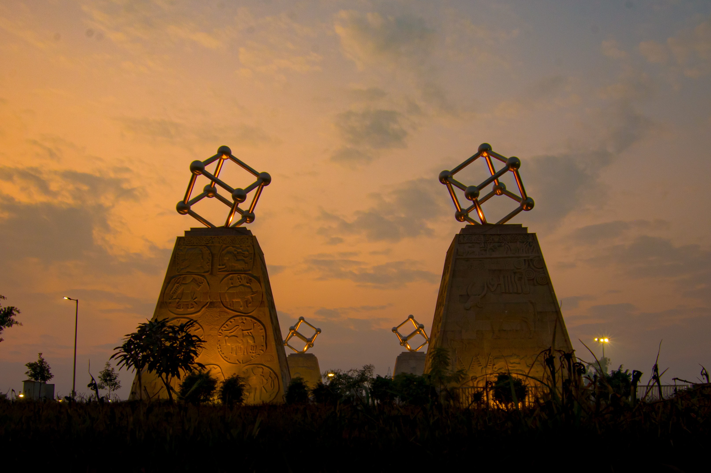

# IIT Ropar

## Welcome to IIT Ropar

Swagatam to IIT Ropar

Welcome to IIT Ropar, where new students are greeted with open arms and an array of orientation programs designed to help them integrate seamlessly into campus life and feel at home in no time.

[Campus Video](https://drive.google.com/file/d/1Iq39k0rplGGp_Yc4FM37wGkj0QKrDReW/view)

---

## Exciting news for JEE Advanced cleared Students!

Joy of Computing Workshop

Attend our exclusive, **free** workshop at IIT Ropar for JEE Advanced cleared students, and explore the endless possibilities of the digital world through engaging, hands-on experiences.

For further details: [Visit our website](https://www.iitrpr.ac.in/swagatam/)

Location - CSE Department, IIT Ropar

---

## Information Corner

Offering essential information to prepare you for a successful start at IIT Ropar, ensuring you're fully informed and ready.

Handbook of Information

This PDF contains all the academic details for freshmen joining IIT Ropar. Download from [here](https://www.iitrpr.ac.in/sites/default/files/Handbook-of-Information-AY-2024-25.pdf)

Connect to ISMP

Connect with ISMP mentors for personalized guidance and support here and explore their [website](https://www.iitrpr.ac.in/ismp/) to learn about the culture at IIT Ropar.

Contact details for academic/admission related queries:

- Academic Section Queries: [01881-231111](tel:+91881231111), [231113](tel:+91881231113), [231176](tel:+91881231176)
- Email: [officer-academics-1@iitrpr.ac.in](mailto:officer-academics-1@iitrpr.ac.in), [jr.acad@iitrpr.ac.in](mailto:jr.acad@iitrpr.ac.in)

---

## Join Our

[Linktree](https://linktr.ee/iitropar)

[Instagram](https://www.instagram.com/iit_ropar_official?utm_source=ig_web_button_share_sheet&igsh=ZDNlZDc0MzIxNw==)

[YouTube Channel](https://www.youtube.com/@VidyaVaniIITRopar)

---

## Frequently Asked Questions

### Q1: What makes IIT Ropar unique compared to other IITs?

IIT Ropar stands out for several reasons that contribute to its unique identity among the IITs:

- **AI for All:** No matter what branch you came from, we at IIT Ropar give you the opportunity to get a minor in AI.
- **Branch Change:** IIT Ropar offers a branch change option at the end of the 1st year.
- **Global Collaborations:** We participate in international research projects and exchange programs.
- **6-Month Internship Opportunity:** We offer a 6-month internship opportunity for 3rd-year students.
- **Location, Location, Location:** Located in the land of five rivers, our lush green campus offers a peaceful life.
- **New Buildings and Hostels:** We have brand new, beautiful buildings, iconic structures, and modern hostels.

### Q2: What are the main focuses of the Workshop?

The shift from JEE preparation to college life is typically quite challenging for students. This initiative aims to serve as a bridge between the students' coaching days and their college days. Engaging concepts will be taught in a fun and interactive manner. Utilizing software like Geogebra, students will be presented with problems designed to enhance their understanding and encourage critical thinking. Connecting concepts, practical applications, and brainstorming will help boost students' confidence and their ability to think critically.
